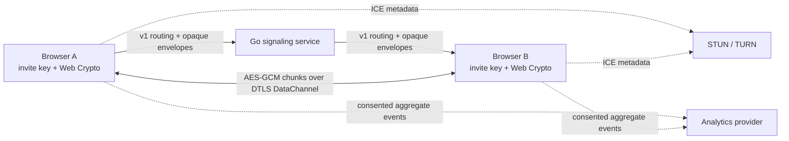

# CoralSend data flow

## Components and boundaries

The signaling service owns membership, room settings, approval, host capability, routing, and errors. Peer profiles, SDP/ICE, chat, file metadata/requests, and file transfer controls are encrypted by browsers. File bytes never pass through or persist on the signaling service.

## Data classes

| Data | Server visibility | Browser retention |
| --- | --- | --- |
| Room ID, device UUID, IP, timing, type, target, sizes | Visible | Room ID/timestamps may remain in redacted history |
| Room settings, membership UUID/join time, approval, host capability | Visible | Current tab memory; host token is not persisted |
| Invite key | Not sent by HTTP, signaling, TURN, logs, or analytics | `sessionStorage` and controlled byte buffers; cleared on explicit leave |
| Profile, SDP/ICE, chat, file metadata/request | AES-GCM envelope only | Current room memory only |
| File chunks | Never handled by signaling; encrypted even over TURN | Transfer memory or user-selected output; finalized only after authentication and size checks |
| Analytics | Allow-listed bucket properties only | Consent state may persist; no room/device/transfer identifier or content |

Downloaded files leave CoralSend's retention boundary. Network and service logs must never include raw peer payloads, invite keys, chat, or filenames.

See [protocol v1](../protocol-v1.md) and the [threat model](threat-model.md).
